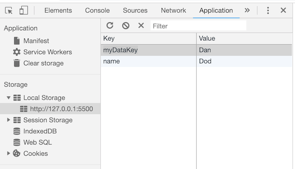

## Browser Storage

We'll learn how to use `localStorage` and `sessionStorage` to store data natively in the browser and use it later.

These browser APIs let you do full, real page reloads while maintaining state and user data. They’re great for enhancing the user experience.

For this week’s projects, you’ll use browser storage to track progress across a multi-page form, and display a progress bar to track the user’s progress. You also setup some shopping cart filters to narrow down a set of products.

## localStorage and sessionStorage

There are two browser APIs you can use to save data natively in the browser: `localStorage` and `sessionStorage`. They work mostly the same way, with a few notable differences.

### localStorage

The localStorage API lets you store data locally that the browser can access later. This data is stored indefinitely and must be a string.

There are three methods in the API:

1. `setItem(key, value)` saves data to localStorage. The first argument is the key for the data, and the second is the data itself.
1. `getItem(key)` retrieves saved data from localStorage using a provided key.
1. `removeItem(key)` will remove data saved to the provided key from localStorage.

```js
// Store data
var someData = 'The data that I want to store for later.';
localStorage.setItem('myDataKey', someData);

// Get data
var data = localStorage.getItem('myDataKey');

// Remove data
localStorage.removeItem('myDatakey');
```

Your data must be a string. If you try to store an array or object, you’ll get back a string instead:

```js
var dinner = {
    main: 'lasagna',
    dessert: 'parfait',
    drink: 'Red Wine'
};

// Save dinner to localStorage
localStorage.setItem('dinnerOrder', dinner);

// Get dinner
// returns "[object Object]"
localStorage.getItem('dinnerOrder');
```

### sessionStorage

The sessionStorage API works just like localStorage, except the data is cleared when the browser session ends. If the user closes the browser or opens a new tab to the same page, that’s generally a new session.

```js
// Store data
var someTempData = 'The data that I want to store temporarily.';
sessionStorage.setItem('myTempDataKey', someTempData);

// Get data
var tempData = sessionStorage.getItem('myTempDataKey');

// Remove data
sessionStorage.removeItem('myTempDatakey');
```

## Storing arrays and objects

Data stored with the browser storage APIs must be a string, so how do you save arrays and objects or data?

You can convert arrays and objects to strings (and then transform them back) using `JSON.stringify()`. This allows you to store multiple values as a single item.

The JSON.stringify() method converts objects into strings.

```js
var dinner = {
    main: 'lasagna',
    dessert: 'parfait',
    drink: 'Red Wine'
};

// Save data to local storage
localStorage.setItem('dinnerOrder', JSON.stringify(dinner));
```

It works with arrays, too.

```js
// Drink options
var drinks = ['wine', 'cocktail', 'soda'];

// Save data to local storage
localStorage.setItem('drinkOptions', JSON.stringify(drinks));
```

### JSON.parse

The JSON.parse method converts stringified JSON back into an object or array.

```js
// Get data from local storage
var savedDinner = JSON.parse(localStorage.getItem('dinnerOrder'));
var savedDrinks = JSON.parse(localStorage.getItem('drinkOptions'));
```

If there is no saved entry in localStorage (or sessionStorage), calling JSON.parse() with null will throw an error. As a result, it’s a good idea to check that the item exists first:

```js
// Get data
var savedLunch = localStorage.getItem('lunchOrder');

// If there's data, convert it back to an object
if (data) {
    data = JSON.parse(data);
}
```

## Storage Limits

Browsers provide differing levels of storage space for localStorage and sessionStorage, ranging from as little as 2mb up to unlimited.

To make things more confusing, some browsers limit both localStorage and sessionStorage, while others do not restrict sessionStorage size. Not doing so is what’s in the W3C standard, but not all browsers historically adhered to it.

For browsers with a maximum storage limit, this amount is a total allowable amount of data, not just a max for your specific site or web app. Accordingly, you should try to reduce the overall footprint of your data as much as possible.

## Expiring localStorage data

Unlike cookies, localStorage does not have a native method for expiring data. It’s kept in storage until you or the user explicitly delete it.

However, there’s a technique you can use to keep data for longer than a browser session, but not forever.

Save your data as an object with two keys:

1. The data key holds the data itself.
1. The timestamp key is the date your data was saved on. We can compare it to the current date, and fetch new data or delete it after a certain period of time.

### Setting a “saved on” date

This part is relatively straightforward.

Create an object with your two keys. Set the data key as your data, and use `new Date().getTime()` for the timestamp key. This creates a UTC timestamp of the current time.

Then, stringify your object and save it to localStorage.

```js
// Setup the localStorage data
var saved = {
    data: data,
    timestamp: new Date().getTime()
};

// Save to localStorage
localStorage.setItem('myData', JSON.stringify(saved));
```

### Checking your timestamp

After getting your data out of localStorage, make sure that it has data and timestamp keys. If it does, we can compare the timestamp to the current time and act accordingly.

First, let’s get the difference between our timestamp and the current time. This gives us a number in milliseconds.

```js
var isDataValid = function (saved) {

    // Check that there's data, and a timestamp key
    if (!saved || !saved.data || !saved.timestamp) return false;

    // Get the difference between the timestamp and current time
    var difference = new Date().getTime() - cache.timestamp;

};
```

Next, we’ll convert that difference from milliseconds into hours.

To do that, we’ll divide it by the number of millseconds in an hour. We can use JS math operators to figure that out for us. We’ll multiply 1000 milliseconds (the number in a second) by 60 seconds (the number in a minute), and again by 60 minutes (the number in an hour).

Then, we’ll divide the difference by that number.

```js
var isDataValid = function (saved) {

    // Check that there's data, and a timestamp key
    if (!saved || !saved.data || !saved.timestamp) return false;

    // Get the difference between the timestamp and current time
    var difference = new Date().getTime() - cache.timestamp;

    // Convert the difference into hours
    var oneHour = 1000 * 60 * 60;
    var convertedTime = difference / oneHour;

};
```

Finally, we’ll check that the convertedTime in hours is less than 1. If it is, we’ll return true.

```js
var isDataValid = function (saved) {

    // Check that there's data, and a timestamp key
    if (!saved || !saved.data || !saved.timestamp) return false;

    // Get the difference between the timestamp and current time
    var difference = new Date().getTime() - cache.timestamp;

    // Convert the difference into hours
    var oneHour = 1000 * 60 * 60;
    var convertedTime = difference / oneHour;

    // Check if it's been less than an hour
    if (convertedTime < 1) return true;

};
```

And you’d use it like this.

```js
// Get data from localStorage
var saved = JSON.parse(localStorage.getItem('myData'));

// Check its validity
if (isDataValid(saved)) {
    // The data is still good, use it
} else {
    // Get fresh data and use that instead
}
```

### Other expiration times

If, like me, you find this kind of math confusing, I wanted to provide some helpful numbers you can work with.

```js
// 1 Hour = 1000ms * 60s * 60m
var oneHour = 1000 * 60 * 60;

// 1 Day =  1000ms * 60s * 60m * 24h
var oneDay = 1000 * 60 * 60 * 24;

// 1 Week =  1000ms * 60s * 60m * 24h * 7 days
var oneWeek = 1000 * 60 * 60 * 24 * 7;

// 1 Year =  1000ms * 60s * 60m * 24h * 365 days
var oneYear = 1000 * 60 * 60 * 24 * 365;
```

If you you wanted to use units other than “one,” multiply any of those by your preferred quantity.

For example, to expire after 12 hours, you would do this:

```js
// 12 Hours = 1000ms * 60s * 60m * 12
var twelveHours = 1000 * 60 * 60 * 12;
```

For four weeks, you’d do this:

```js
// 4 Weeks =  1000ms * 60s * 60m * 24h * 7 days * 4
var fourWeeks = 1000 * 60 * 60 * 24 * 7 * 4;
```

## EXERCISE

Let's build a form that automatically saves a user’s data as they type.

### The template

The template for this project is a form with a variety of input types, as well as a select menu and textarea element.

The form has a class and ID of save-me. Each form element has a unique ID you can hook into.

```html
<form class="save-me" id="save-me">

    <label for="name">Name</label>
    <input type="text" name="name" id="name">

    <label for="address">Address</label>
    <input type="text" name="address" id="address">

    <label for="email">Email</label>
    <input type="email" name="email" id="email">

    <label for="hear-about-us">How did you hear about us?</label>
    <select name="hear-about-us" id="hear-about-us">
        <option value=""></option>
        <option value="google">Google</option>
        <option value="referral">Referred by a Friend</option>
        <option value="tv">A TV Ad</option>
        <option value="radio">A Radio Ad</option>
    </select>

    <label id="more">Additional thoughts?</label>
    <textarea name="more" id="more"></textarea>

    <p><strong>Do you agree to our terms of service?</strong></p>
    <label class="label-plain">
        <input type="radio" name="tos" value="yes">
        Yes
    </label>
    <label class="label-plain">
        <input type="radio" name="tos" value="no">
        No
    </label>

    <p><strong>Pick your favorite super heros.</strong></p>

    <label class="label-plain">
        <input type="checkbox" name="spiderman">
        Spiderman
    </label>

    <label class="label-plain">
        <input type="checkbox" name="wonderwoman">
        Wonder Woman
    </label>

    <label class="label-plain">
        <input type="checkbox" name="blackpanther">
        Black Panther
    </label>

    <p><button type="submit">Submit</button></p>

</form>
```

As the user types, we'll save their data in real time to `localStorage`. When the page loads, automatically populate the form fields with any saved data.

You should be able to type, reload the page in the browser (or quit and come back later) and see all of your data just as you left it.

When the user clicks submit, wipe out any saved data.

Will you store each element individually, or as part of a single item in localStorage? How will you match fields against data in localStorage? What would happen if there were more than one form on the page?


```js
// Your code goes here...

const formElem = document.getElementById('save-me');

var saveData = function(){
  var someData = 'The data that I want to store for later.';
  localStorage.setItem('myDataKey', someData);
  getData()
}

var getData = function(){
  var data = localStorage.getItem('myDataKey');
  console.log(data)
}

formElem.addEventListener('input', saveData);
```

Let's focus on the first input field.

```js
// Your code goes here...

const formElem = document.getElementById('save-me');

var saveData = function(){
  var someData = document.querySelector('#name').value;
  console.log(someData);
  localStorage.setItem('name', someData);
  getData()
}

var getData = function(){
  var data = localStorage.getItem('name');
  console.log(data)
}

formElem.addEventListener('input', saveData);
```

At this point you should start using the Application portion of the browser's inspector:



Note the you can right click on the Local Storage url to clear the contents.

When you add an event listener, that event is passed to the function. We can use the `event.target` property to get the element and `event.target.value` to get the element's contents.

```js
// Your code goes here...

const formElem = document.getElementById('save-me');

var saveData = function(){
  var someData = document.querySelector('#name').value;
  console.log(event.target.value);
  localStorage.setItem('name', someData);
  getData()
}

var getData = function(){
  var data = localStorage.getItem('name');
  console.log(data)
}

formElem.addEventListener('input', saveData);
```

We'll use `event.target` to set both the target (the name of the input field) and the target's value (the value of the input field) to JSON.

```js
// Your code goes here...

const formElem = document.getElementById('save-me');

var saveData = function(){

  var elem = event.target.id;
  var someData = event.target.value;

  var dataKey = JSON.stringify(elem);
  var inputData = JSON.stringify(someData);

  localStorage.setItem(dataKey, inputData);
  getData(dataKey)
}

var getData = function(key){
  console.log(key)  
  var data = localStorage.getItem(key);
  console.log(data)
}

formElem.addEventListener('input', saveData);
```

Let's try accounting for elements that do not have an id such as radio buttons and check boxes.

```js
const formElem = document.getElementById('save-me');
var faves = []; // NEW 

var saveData = function(){
  
  if(event.target.id){
    var elem = event.target.id;
    var someData = event.target.value;
  } else if (event.target.type == 'radio'){
    var elem = event.target.name;
    var someData = event.target.value;
  } else if (event.target.type == 'checkbox'){
    var elem = 'faves';
    faves.push(event.target.name)
    var someData = faves;
  }
  
  var dataKey = elem;  // NEW
  var inputData = JSON.stringify(someData);
  
  localStorage.setItem(dataKey, inputData);
  getData(dataKey)
}

var getData = function(key){
  console.log(key)  
  var data = localStorage.getItem(key);
  console.log(data)
}

formElem.addEventListener('input', saveData);
```

Now let's focus on refreshing and onload - events which should populate the form with data from local storage. Fortunately we already have a `getData()` function we can use.

Consult [MDN's Events page](https://developer.mozilla.org/en-US/docs/Web/Events)

```js
var getData = function(){
  var nameItem = JSON.parse(localStorage.getItem('name'));
  if (nameItem) {
    document.querySelector('#name').value = nameItem;
  } else {
    document.querySelector('#name').placeholder = 'Please enter a name';
  }
}

window.addEventListener('load', getData);
```

Its at this point where we realize that getting and setting these values could get quite long and that there is probably a better way. But that's OK - most scripts start out rough and then are refined as you proceed. 


